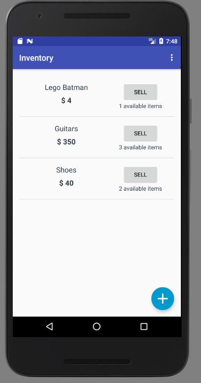
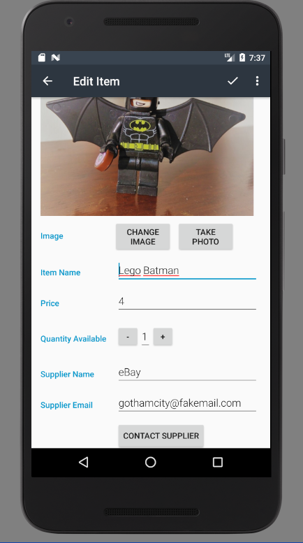

# Inventory

This app allows to create and keep track of a product inventory stored in a SQLite Database.

## Features

- Use of `intents` to access gallery and camera to store a photo of a product.
- Performs CRUD using `SQLiteDatabase`.
- Use of `contentProvider`.
- Input validation.

## Screenshots

